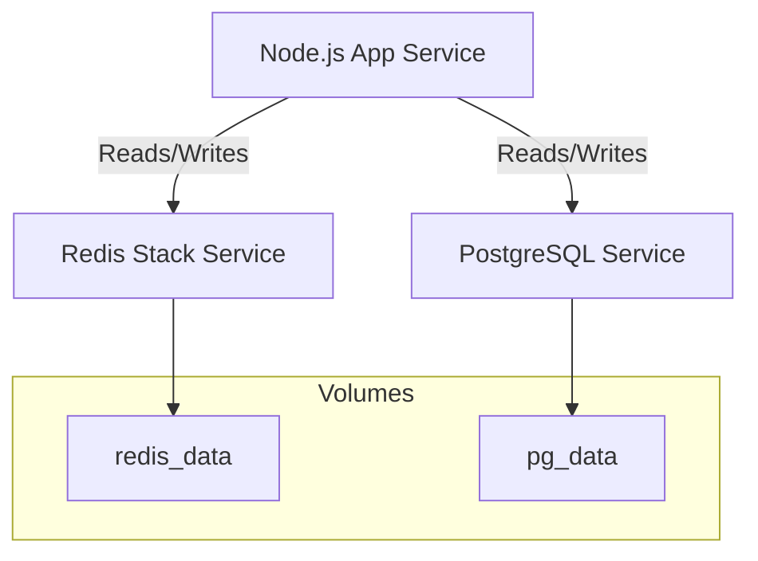

# ChronoCascade Memory Engine - Persistence Layer Design (Dockerized)

## 📋 Overview

This design implements a **hybrid three-tier persistence architecture** optimized for **Docker Compose** deployment. It ensures data durability, ease of deployment, and scalability while mapping to the biological memory hierarchy.

| Layer | Technology | Docker Service | Persistence Strategy |
|-------|-----------|----------------|----------------------|
| **Layer 0** | In-Memory | `app` | Volatile (Application memory) |
| **Layer 1** | Redis Stack | `redis-stack` | Named Volume (`redis_data`) + AOF |
| **Layer 2** | PostgreSQL + pgvector | `postgres` | Named Volume (`pg_data`) + Init Scripts |

---

## 🐳 Docker Architecture Design

### System Composition
The system runs as a multi-container application defined in `docker-compose.yml`.



### 1. Redis Service (Layer 1)
- **Image**: `redis/redis-stack-server:latest` (Includes RediSearch, RedisJSON)
- **Configuration**:
  - `appendonly yes`: Ensures data durability across restarts.
  - `save 60 1`: Snapshots every minute if at least 1 key changes.
- **Volume**: `redis_data:/data` ensures cache persistence across container recreation.

### 2. PostgreSQL Service (Layer 2)
- **Image**: `pgvector/pgvector:pg16` (Official Postgres with pgvector extension pre-installed)
- **Initialization**: 
  - Uses `/docker-entrypoint-initdb.d/` to automatically run schema creation scripts (`01_init.sql`).
- **Volume**: `pg_data:/var/lib/postgresql/data` ensures long-term data survival.
- **Environment**: Configured via `.env` file for security.

### 3. Application Service
- **Dependency**: Waits for Redis and Postgres to be healthy (`healthcheck` + `depends_on`).
- **Network**: All services share a private backend network `ccme_network`.

---

## 📊 Layer Details & Docker Integration

### 🔴 Layer 1: Redis + RediSearch (Mid-Term)

#### Docker Configuration
```yaml
  redis-stack:
    image: redis/redis-stack-server:latest
    ports:
      - "6379:6379"
    volumes:
      - redis_data:/data
    command: ["redis-stack-server", "--appendonly", "yes"]
    healthcheck:
      test: ["CMD", "redis-cli", "ping"]
      interval: 10s
      timeout: 5s
      retries: 5
```

#### Persistence Strategy
- **AOF (Append Only File)**: Enabled to log every write operation, minimizing data loss.
- **RDB (Snapshots)**: Periodic snapshots for faster startup recovery.

### 🟢 Layer 2: PostgreSQL + pgvector (Long-Term)

#### Docker Configuration
```yaml
  postgres:
    image: pgvector/pgvector:pg16
    ports:
      - "5432:5432"
    environment:
      POSTGRES_USER: ${PG_USER}
      POSTGRES_PASSWORD: ${PG_PASSWORD}
      POSTGRES_DB: ${PG_DATABASE}
    volumes:
      - pg_data:/var/lib/postgresql/data
      - ./scripts/db/init:/docker-entrypoint-initdb.d
    healthcheck:
      test: ["CMD-SHELL", "pg_isready -U ${PG_USER} -d ${PG_DATABASE}"]
      interval: 10s
      timeout: 5s
      retries: 5
```

#### Initialization Strategy
- **Schema Management**: SQL scripts in `./scripts/db/init/` are automatically executed on first container startup.
- **Extensions**: `CREATE EXTENSION IF NOT EXISTS vector;` is included in the init script.

---

## 🔄 Data Lifecycle & Operations

### Startup Sequence
1. **Postgres** starts -> Mounts volume -> Checks if data exists -> If not, runs init scripts.
2. **Redis** starts -> Mounts volume -> Loads AOF/RDB into memory.
3. **App** starts -> Waits for Postgres & Redis healthchecks -> Connects.

### Backup Strategy
- **Layer 1 (Redis)**: 
  - `docker exec redis-stack redis-cli save` to force snapshot.
  - Backup `/var/lib/docker/volumes/ccme_redis_data/_data/dump.rdb`.
- **Layer 2 (Postgres)**:
  - `docker exec postgres pg_dump -U user dbname > backup.sql`
  - Automated cron job recommended for production.

---

## 🔧 Developer Workflow

### Prerequisites
- Docker & Docker Compose installed.
- `.env` file configured.

### Commands
- **Start System**: `docker-compose up -d`
- **View Logs**: `docker-compose logs -f`
- **Reset Data**: `docker-compose down -v` (CAUTION: Deletes all persistent volumes)
- **Access DB**: `docker-compose exec postgres psql -U postgres -d chronocascade`
- **Access Redis**: `docker-compose exec redis-stack redis-cli`

---

## 🔐 Security Considerations

1. **Network Isolation**: 
   - Backend services (Redis, Postgres) should ideally NOT expose ports to host in production (`127.0.0.1:port` or remove `ports` mapping).
   - Only the Application service communicates with them via the internal Docker network.

2. **Secrets Management**:
   - Use `.env` file (gitignored) for local development.
   - Use Docker Secrets for production Swarm/Kubernetes deployments.

3. **User Permissions**:
   - Application connects to Postgres using a non-superuser role (created in init script).
